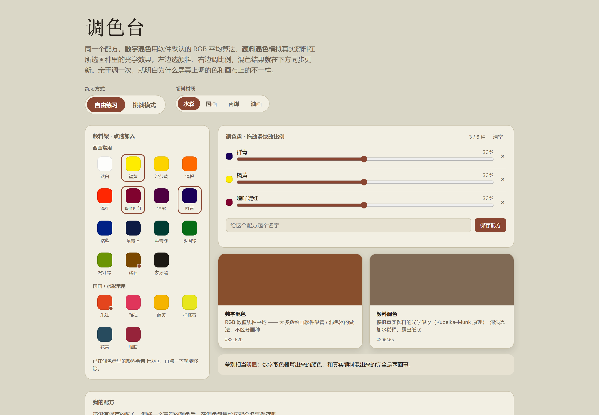

# 调色台 · Mix Studio

> 给画画的人用的调色练习工具。
> 同一个颜料配方，屏幕上按 RGB 算出来的颜色，和真实颜料在画布上混出来的颜色，是**两回事**——这个工具把两者并排放在一起，让你亲手调一次就看明白。



## 在线试用

开启 GitHub Pages 后访问：

```
https://github.com/mirrorxyjiang/color-mix
```

仓库根目录的 `index.html` 是入口页；也可以直接打开同目录下的 `mix-studio.html` 使用。

## 本地运行

不需要安装任何东西，也没有构建步骤：

```bash
git clone https://github.com/mirrorxyjiang/color-mix.git
cd color-mix 
```

然后双击 `index.html`（或 `mix-studio.html`）用浏览器打开即可。

> 混色计算依赖 [Mixbox](https://github.com/scrtwpns/mixbox)，通过 CDN 加载，所以**首次打开需要联网**。网络不通时会自动切换到内置的近似算法，页面右上角会提示——趋势依旧正确，精度略低。

## 功能

- **21 种颜料**：西画常用 15 色 + 国画/水彩常用 6 色，矿物颜料带标记
- **最多 6 种同时调配**：点颜料加入调色盘，拖动滑块改比例，右侧实时显示每种颜料占的百分比
- **两种混色结果对照**
  - 数字混色：RGB 线性平均，也就是大多数软件吸管 / 混色器的做法
  - 颜料混色：基于 Kubelka–Munk 光学吸收模型的真实颜料模拟
  - 下方会根据两者的色差给出一句人话提示，告诉你会不会"翻车"
- **4 种画种**：水彩、国画、丙烯、油画——区分透明与不透明介质，并模拟干后的深浅变化
- **挑战模式**：随机生成目标色，按接近程度打分（基于 CIE Lab 色差），卡住时可以揭晓配方
- **配方本**：调好的颜色起名保存（存浏览器 localStorage），随时读回继续改，或导出成 PNG 分享
- 明暗主题跟随系统；窄屏自动切单列布局

## 目录结构

```
.
├── index.html        # 入口页
├── mix-studio.html   # 调色台本体，单文件，包含全部 HTML / CSS / JS
├── assets/
│   └── preview.png   # README 用的界面截图
├── README.md
└── LICENSE
```

代码全部集中在 `mix-studio.html` 里，改样式或加颜料直接搜对应区块即可：

- `PALETTE` 数组 — 颜料清单（名称、颜色、分组、矿物标记）
- `MEDIA` 对象 — 画种参数（是否透明、干后深浅偏移）
- `renderMixList()` / `renderResults()` — 调色盘与结果区的渲染

## 实现说明

| 部分 | 做法 |
| --- | --- |
| 颜料混色 | 调用 Mixbox（`rgbToLatent` → 隐空间加权平均 → `latentToRgb`） |
| 降级方案 | 无法加载 Mixbox 时改用逐通道几何平均（乘性混合）近似 |
| 介质模拟 | 透明画种按覆盖率向纸白插值，不透明画种直接覆盖；再按 Lab 明度做干后偏移 |
| 评分 | sRGB → 线性 → CIE Lab，取 ΔE 并换算成百分制 |
| 导出图片 | Canvas 2 倍分辨率绘制，优先走下载 API，失败则弹出可长按保存的图片 |

## 致谢

- [Mixbox](https://github.com/scrtwpns/mixbox) — 提供 Kubelka–Munk 模型的颜料混合计算
- 画种差异（透明度、干湿变化）是经验性模拟，不代表精确的介质光谱数据

## License

[MIT](LICENSE) © 2026

第三方依赖 Mixbox 有其自身的许可条款，请以原仓库为准。
